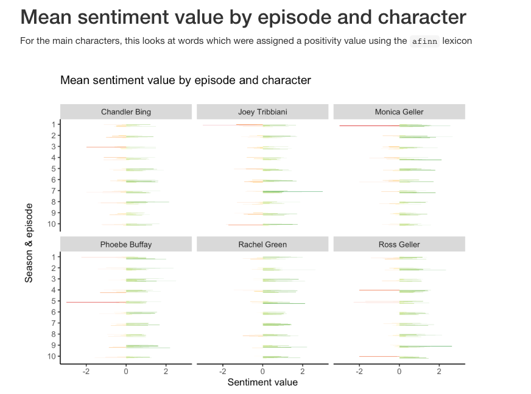
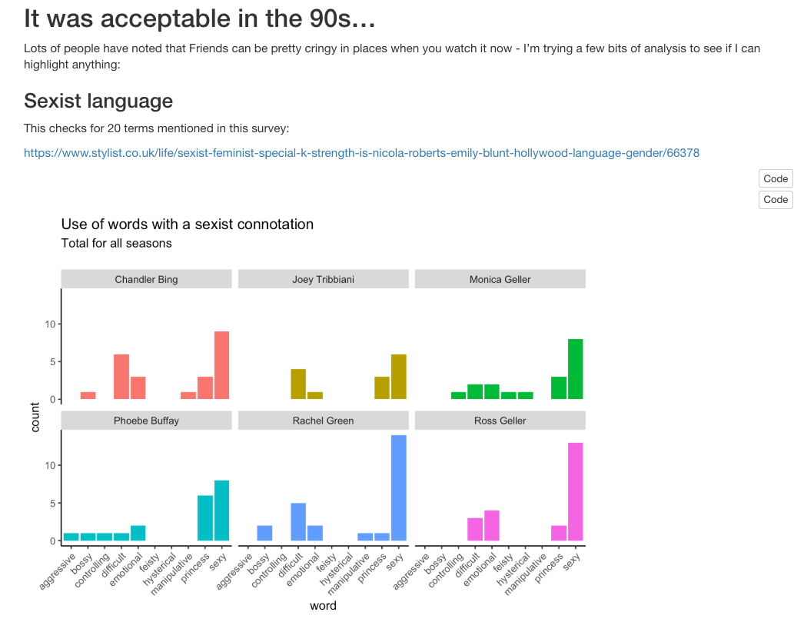

# Text mining project using scripts of the TV show Friends

This project uses R to perform some analysis on the contents of these scripts including:

* Most common words

* Sentiment analysis

* An attempt to identify dated or offensive use of language

 

 

It uses data from the `friends` package.

Details on the package including the data dictionary can be found here:

https://github.com/rfordatascience/tidytuesday/issues/254

 

 

Results are summarised in the file `friends_analysis` (available in R notebook and HTML formats).

# Screenshots of the report - visualisations

# Screenshots of the report - data preparation

